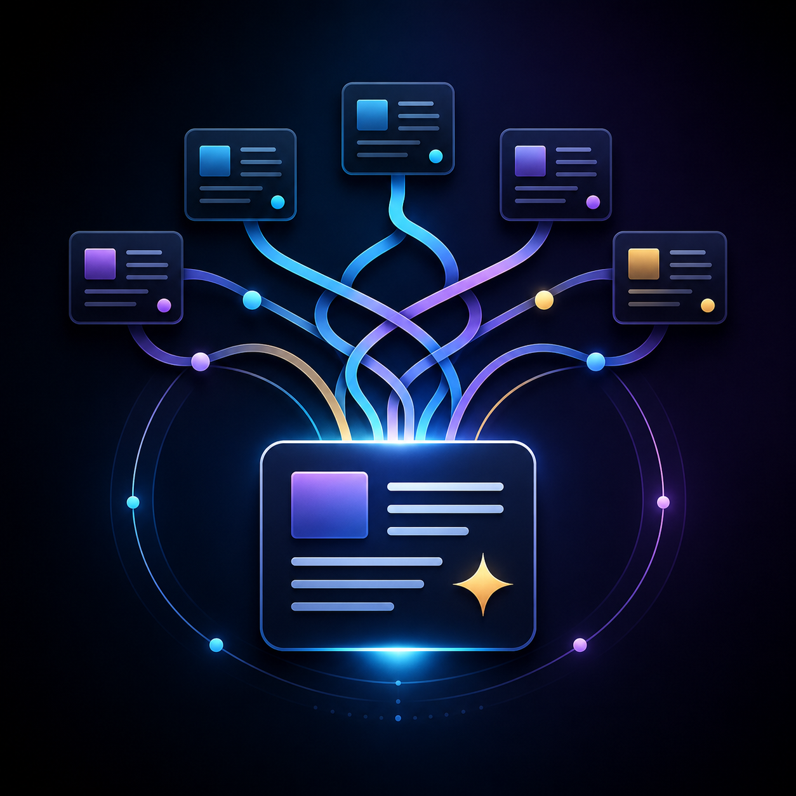

<div align="center">
  

  <h1>NewsWeave</h1>

  <p><strong>Curadoria personalizada de notícias que transforma excesso de informação em briefing diário claro</strong></p>
  <p><strong>Personalized news curation that turns information overload into a clear daily briefing</strong></p>

  <p>
    <a href="#pt-br">PT-BR</a> •
    <a href="#en">English</a> •
    <a href="#stack--tecnologias">Stack</a> •
    <a href="#arquitetura--architecture">Arquitetura</a> •
    <a href="#quick-start--início-rápido">Quick Start</a> •
    <a href="#autor--author">Autor</a>
  </p>

  <p>
    
    
    
    
    
    
  </p>

  <p>
    <a href="https://barujafe.vercel.app/"><strong>🌐 Portfólio</strong></a> •
    <a href="https://github.com/BarujaFe1"><strong>🐙 GitHub</strong></a> •
    <a href="https://www.linkedin.com/in/barujafe/"><strong>💼 LinkedIn</strong></a>
  </p>
</div>

---

<a id="pt-br"></a>

## 🇧🇷 PT-BR

## 📰 Visão geral

**NewsWeave** é um produto de curadoria personalizada de notícias criado para transformar excesso de informação em um briefing diário claro, útil e fácil de escanear.

A proposta não é criar mais um feed genérico. O objetivo é transformar informações espalhadas em uma experiência editorial focada, adaptada aos interesses e prioridades do usuário.

O sistema coleta artigos de fontes selecionadas, normaliza e estrutura os dados, remove redundâncias, ranqueia histórias por relevância e entrega um briefing personalizado com as notícias mais importantes primeiro.

> **Objetivo:** permitir que o usuário escolha fontes e preferências para receber um briefing diário estruturado, personalizado e confiável.

---

## 🎯 Problema que resolve

Quem acompanha notícias com frequência enfrenta sempre o mesmo problema: tempo demais pulando entre fontes, tempo demais vendo a mesma história repetida e tempo demais filtrando ruído antes de chegar ao sinal.

O consumo moderno de notícias é fragmentado. Um usuário que quer se manter informado muitas vezes precisa:

- abrir vários sites;
- comparar coberturas sobre o mesmo assunto;
- remover manualmente histórias repetidas;
- alternar entre fontes amplas e nichadas;
- gastar mais tempo escaneando do que lendo;
- decidir sozinho o que realmente importa.

O **NewsWeave** reduz esse atrito ao dar ao usuário:

- controle sobre fontes;
- controle sobre temas;
- formato de saída estruturado;
- definição mais clara de relevância;
- caminho mais rápido entre notícia bruta e briefing útil.

---

## 💡 Tese do produto

NewsWeave é um produto sobre **curadoria, relevância e clareza**.

Ele parte da ideia de que o valor não está apenas em coletar conteúdo, mas em organizá-lo bem o suficiente para que o usuário confie no resultado final.

A promessa central é simples:

> **Escolha suas fontes e preferências. Receba um briefing diário personalizado, estruturado e fácil de entender.**

---

## ✨ O que o NewsWeave faz

O NewsWeave foi desenhado para atuar como um **motor pessoal de briefing de notícias**.

Em alto nível, ele deve:

1. permitir que o usuário configure fontes preferidas;
2. capturar artigos dessas fontes;
3. limpar e normalizar os dados recebidos;
4. detectar duplicação e cobertura quase duplicada;
5. ranquear itens de acordo com um perfil de interesse;
6. gerar um briefing conciso com as principais histórias;
7. preservar histórico de briefings anteriores.

O resultado não deve parecer um feed infinito. Deve parecer um briefing curto, editorialmente organizado e feito para ajudar o usuário a entender o que importa agora.

---

## ✅ O que entra no MVP

A primeira versão será intencionalmente menor, para ser terminável, polida e publicável.

### MVP inclui

- Seleção e configuração de fontes.
- Preferências de perfil e prioridades de tópicos.
- Ingestão a partir de um conjunto limitado de fontes.
- Parsing e normalização de artigos.
- Detecção de duplicatas.
- Ranking de relevância baseado em regras.
- Geração de briefing top 10.
- Manchetes adicionais úteis.
- Histórico de briefings.

### MVP não inclui

- Rede social.
- Portal genérico de notícias.
- Crawler amplo para toda a web.
- Assistente de notícias baseado em chat.
- Feed infinito.
- App mobile nativo na V1.
- Sistema comportamental avançado de recomendação.
- Personalização pesada com ML na primeira versão.

---

## 🧠 O que este projeto quer provar

NewsWeave foi desenhado para demonstrar que é possível pensar e construir como um engenheiro orientado a produto.

O projeto deve mostrar capacidade de:

- transformar uma ideia vaga em produto concreto;
- definir e proteger escopo de MVP;
- desenhar um fluxo de dados limpo;
- trabalhar com dados textuais estruturados e semiestruturados;
- criar um pipeline de ranking significativo;
- construir backend/API que sustente um produto real;
- moldar uma experiência de usuário intencional e premium;
- documentar um repositório de forma profissional;
- apresentar o projeto com clareza para GitHub, LinkedIn e portfólio.

---

<a id="en"></a>

## 🇺🇸 English

## 📰 Overview

**NewsWeave** is a personalized news curation product created to turn information overload into a clear, useful and easy-to-scan daily briefing.

The goal is not to build another generic news feed. The goal is to transform scattered information into a focused editorial experience tailored to the user's interests and priorities.

The system collects articles from selected sources, normalizes and structures the data, removes redundancy, ranks stories by relevance and delivers a personalized briefing with the most important stories first.

> **Goal:** let users choose sources and preferences, then receive a structured, personalized and reliable daily briefing.

---

## 🎯 Problem solved

Most people who follow news regularly face the same problem: too much time jumping between sources, too much time seeing the same story repeated and too much time filtering noise before reaching signal.

Modern news consumption is fragmented. A user who wants to stay informed often has to:

- open multiple websites;
- compare overlapping coverage;
- manually remove repetitive stories;
- switch between broad feeds and niche sources;
- spend more time scanning than reading;
- decide alone what actually matters.

**NewsWeave** reduces this friction by giving the user:

- control over sources;
- control over themes;
- a structured output format;
- a clearer definition of relevance;
- a faster path from raw news to useful briefing.

---

## 💡 Product thesis

NewsWeave is a product about **curation, relevance and clarity**.

It assumes that the value is not just in collecting content, but in organizing it well enough that the user can trust the final output.

The central promise is simple:

> **Choose your sources and preferences. Receive a daily news briefing that is personalized, structured and easy to understand.**

---

## ✨ What NewsWeave does

NewsWeave is designed to act as a **personal news briefing engine**.

At a high level, it should:

1. let the user configure preferred sources;
2. capture articles from those sources;
3. clean and normalize incoming data;
4. detect duplicate and near-duplicate coverage;
5. rank items according to an interest profile;
6. generate a concise briefing with the top stories;
7. preserve a history of previous briefings.

The output is not meant to feel like an infinite feed. It is meant to feel like a short, editorially organized briefing that helps the user understand what matters now.

---

## ✅ What goes into the MVP

The first version is intentionally smaller so it can be finished, polished and published.

### MVP includes

- Source selection and configuration.
- Profile preferences and topic priorities.
- Ingestion from a limited set of sources.
- Article parsing and normalization.
- Duplicate detection.
- Rule-based relevance ranking.
- Top 10 briefing generation.
- Additional useful headlines.
- Briefing history.

### MVP does not include

- Social network.
- Generic news portal.
- Full-scale crawler for the open web.
- Chat-based news assistant.
- Infinite-scroll feed.
- Native mobile app in V1.
- Advanced behavioral recommender system.
- Heavy ML-based personalization in the first version.

---

## 🧠 What this project is meant to prove

NewsWeave is designed to demonstrate product-minded engineering.

It should show the ability to:

- turn a vague idea into a concrete product;
- define and protect an MVP scope;
- design a clean data flow;
- work with structured and semi-structured text data;
- create a meaningful ranking pipeline;
- build a backend/API that supports a real product;
- shape an intentional and premium user experience;
- document a repository professionally;
- present the project clearly for GitHub, LinkedIn and portfolio use.

---

<a id="stack--tecnologias"></a>

## 🛠️ Stack / Tecnologias

### Frontend

- **Next.js**
- **TypeScript**
- **Tailwind CSS**

### Backend

- **FastAPI**
- **Python**
- **SQLAlchemy**
- **Alembic**

### Data

- **PostgreSQL**

### Ingestion and parsing

- **feedparser**
- **trafilatura**
- **BeautifulSoup**
- **selectolax**

### Supporting tools

- **Docker Compose**
- **GitHub Actions**
- **Conventional Commits**
- **Markdown documentation**

---

<a id="arquitetura--architecture"></a>

## 🏗️ Arquitetura / Architecture

The architecture is intentionally simple and explainable.

```txt
User preferences
   ↓
API
   ↓
Ingestion jobs
   ↓
Parsing and cleaning
   ↓
Deduplication
   ↓
Ranking
   ↓
Briefing generation
   ↓
UI
```

### Responsabilidades / Responsibilities

| Layer | Responsibility |
|---|---|
| Frontend | Experience, presentation, preference screens and briefing UI |
| Backend | Product logic, API, ingestion orchestration and data operations |
| Database | Sources, articles, preferences, rankings and briefings |
| Scripts | Ingestion helpers, seed data and operational tasks |
| Docs | Product decisions, architecture, roadmap and case study material |

This keeps the project realistic, maintainable and easy to explain.

---

## 🔄 Data Flow / Fluxo de dados

```txt
Selected Sources
   ↓
RSS / Article Fetching
   ↓
Parsing
   ↓
Cleaning
   ↓
Normalization
   ↓
Duplicate Detection
   ↓
Relevance Ranking
   ↓
Briefing Builder
   ↓
Dashboard / Briefing UI
```

---

## 🧬 Modelo de dados / Data model

Planned core entities:

- `users` or local profile configuration;
- `sources`;
- `source_categories`;
- `user_preferences`;
- `topics`;
- `articles`;
- `article_topics`;
- `briefings`;
- `briefing_items`;
- `ingestion_runs`.

### Article fields

- title;
- source;
- author, when available;
- original URL;
- normalized URL;
- published date;
- extracted summary;
- cleaned text snippet;
- topic tags;
- duplicate group;
- relevance score;
- collected date.

### Briefing fields

- date;
- profile snapshot;
- top stories;
- additional headlines;
- ranking explanations;
- source coverage;
- generated at.

---

## 🧠 Ranking approach / Abordagem de ranking

The first version uses rule-based relevance ranking.

Signals may include:

- topic match with user preferences;
- source priority;
- recency;
- duplicate coverage count;
- keyword matches;
- article completeness;
- manual source weight;
- category priority.

The goal is not to pretend to be magical. The goal is to produce a ranking that is understandable, testable and good enough for a strong MVP.

---

## 🧹 Deduplication / Deduplicação

The MVP uses pragmatic deduplication:

- normalized URLs;
- title normalization;
- source-aware comparison;
- similarity on headlines;
- duplicate group assignment.

The goal is to reduce repeated coverage without overengineering a full semantic clustering system too early.

---

## 📁 Repository structure / Estrutura do repositório

```txt
newsweave/
├── frontend/
│   ├── app/
│   ├── components/
│   ├── lib/
│   ├── public/
│   └── package.json
├── backend/
│   ├── app/
│   │   ├── api/
│   │   ├── models/
│   │   ├── schemas/
│   │   ├── ingestion/
│   │   ├── parsing/
│   │   ├── ranking/
│   │   ├── dedup/
│   │   └── briefing/
│   ├── tests/
│   ├── scripts/
│   └── migrations/
├── scripts/
├── data/
├── docs/
│   ├── product-requirements.md
│   ├── architecture.md
│   ├── roadmap.md
│   ├── data-model.md
│   ├── api-contract.md
│   └── case-study.md
├── assets/
├── .github/
├── README.md
├── LICENSE
├── CHANGELOG.md
├── CONTRIBUTING.md
├── .env.example
└── docker-compose.yml
```

---

## 🗺️ Roadmap

### Phase 0 — Foundation

- [ ] Finalize product definition.
- [ ] Create repository structure.
- [ ] Write initial documentation.
- [ ] Define data model and API contract.
- [ ] Create GitHub issues and milestones.

### Phase 1 — Technical baseline

- [ ] Initialize frontend.
- [ ] Initialize backend.
- [ ] Configure PostgreSQL locally.
- [ ] Create initial models and migrations.
- [ ] Add first CI checks.

### Phase 2 — Core flow

- [ ] Create source management.
- [ ] Define user preferences.
- [ ] Ingest articles from selected sources.
- [ ] Normalize and store news items.
- [ ] Generate first briefing.

### Phase 3 — Relevance and quality

- [ ] Deduplicate articles.
- [ ] Improve ranking rules.
- [ ] Add explanation fields.
- [ ] Add tests for core behavior.
- [ ] Harden ingestion flow.

### Phase 4 — Product polish

- [ ] Improve UI.
- [ ] Add dark mode.
- [ ] Refine spacing, typography and hierarchy.
- [ ] Add loading and empty states.
- [ ] Create demo-ready screenshots.

### Phase 5 — Public release

- [ ] Finalize documentation.
- [ ] Prepare public story.
- [ ] Create short demo video.
- [ ] Publish repository.
- [ ] Share on LinkedIn and portfolio channels.

---

## 📌 Status

**Current status:** project definition and repository preparation.

At this stage, the focus is on:

- clarifying the MVP;
- locking the architecture;
- preparing the repository structure;
- writing core documentation;
- avoiding premature implementation.

---

<a id="quick-start--início-rápido"></a>

## 🚀 Quick Start / Início rápido

The project will be organized to run locally with:

- Node.js for the frontend;
- Python for the backend;
- PostgreSQL for persistence;
- Docker Compose for local services.

### Expected local workflow

```bash
git clone https://github.com/BarujaFe1/newsweave.git
cd newsweave
docker compose up -d
```

Backend:

```bash
cd backend
python -m venv .venv

# Windows
.venv\Scripts\activate

# Linux/macOS
source .venv/bin/activate

pip install -r requirements.txt
alembic upgrade head
uvicorn app.main:app --reload
```

Frontend:

```bash
cd frontend
npm install
npm run dev
```

Planned access:

```txt
Frontend: http://localhost:3000
Backend:  http://localhost:8000
API Docs: http://localhost:8000/docs
```

Setup instructions should be refined as implementation begins.

---

## 📸 Demo and screenshots / Demo e screenshots

The V1 should include screenshots that prove the product is real:

- onboarding or source setup;
- preference configuration;
- generated daily briefing;
- article detail;
- briefing history;
- API documentation;
- ingestion logs or pipeline status.

---

## ⚠️ Known risks / Riscos conhecidos

- Source layout changes.
- Inconsistent RSS metadata.
- Duplicate or near-duplicate stories.
- Ranking rules becoming too complex too early.
- Scope creep toward a generic news portal.
- Temptation to add chat or recommendation features before the MVP is stable.

The project strategy is to keep the MVP focused, explainable and publishable.

---

## 💼 Portfolio value / Valor para portfólio

NewsWeave is designed to work well as:

- GitHub project;
- LinkedIn post;
- portfolio case study;
- technical interview conversation;
- product thinking example;
- full-stack data pipeline example.

It demonstrates:

- product strategy;
- MVP scoping;
- data pipeline design;
- backend/API design;
- user experience;
- documentation quality.

---

## 🤝 Contributing / Contribuição

Contributions are welcome, especially around:

- ingestion reliability;
- article parsing;
- deduplication;
- ranking explanations;
- dashboard UX;
- documentation.

Recommended flow:

```bash
git checkout -b feature/your-feature
git commit -m "feat: describe your change"
git push origin feature/your-feature
```

Then open a Pull Request.

---

<a id="autor--author"></a>

## 👤 Autor / Author

Developed by **Felipe Baruja**.

- **Portfolio:** [https://barujafe.vercel.app/](https://barujafe.vercel.app/)
- **GitHub:** [github.com/BarujaFe1](https://github.com/BarujaFe1)
- **LinkedIn:** [linkedin.com/in/barujafe](https://www.linkedin.com/in/barujafe/)

---

## 📄 License / Licença

MIT License.

See [LICENSE](./LICENSE) for details.

---

<div align="center">
  <p><strong>NewsWeave</strong></p>
  <p>Scattered information in. Clear daily briefing out.</p>
  <p><em>Informação espalhada entra. Briefing diário claro sai.</em></p>
</div>
